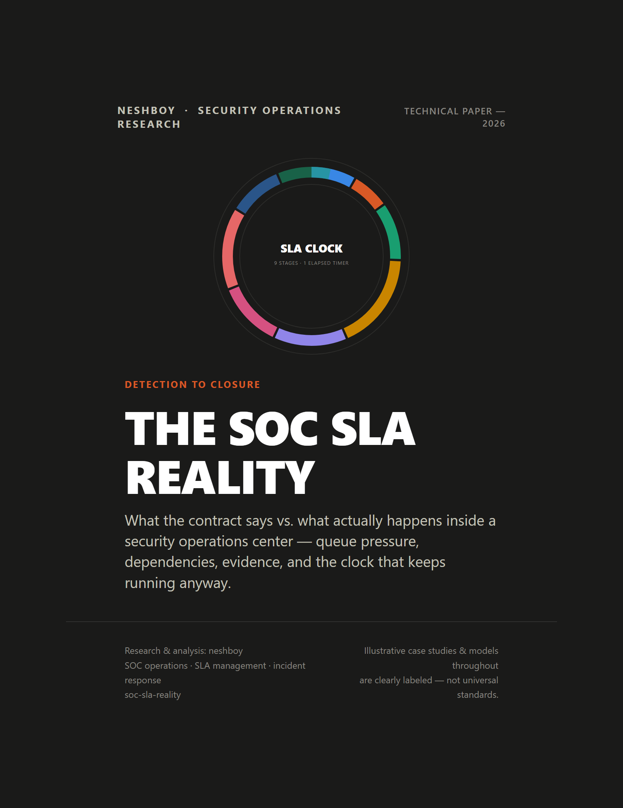

# The SOC SLA Reality

**What the contract says vs. what actually happens inside a security operations center.**

A technical paper about the gap between the SLA written into a contract and the SLA actually managed inside a live SOC — queue pressure, dependencies, evidence, and the clock that keeps running anyway.



## Why this paper exists

"P1 = 15 minutes" tables show up everywhere in SOC training and marketing decks, presented as if they were an industry standard. They aren't. No source reviewed for this paper — NIST, CISA, FIRST, SANS, ITIL, or named vendor documentation (Microsoft, IBM/QRadar, Google SecOps, Splunk, Palo Alto Networks, CrowdStrike, SentinelOne, ServiceNow) — publishes a single universal severity-to-minutes standard. Every real SLA table is contract-, customer-, and SOC-specific.

Meanwhile, actual SOC operations run on a different logic entirely: 20 alerts hitting at once, a P1 crossing a shift boundary, a customer who won't answer, a SIEM that reports the world 29 minutes late, three P1s and two analysts. This paper is about that second reality — and about the fact that **meeting the SLA does not always mean the investigation was good, and breaching the SLA does not automatically mean the SOC failed.**

## Central thesis

> An SLA measures elapsed time. A SOC manages uncertainty, dependencies, evidence, and risk — only one of those four fits neatly on a countdown clock.

## What's covered

- The four things everyone calls "the SLA" — Book, Contractual, Operational, and Customer Expectation — and why the same incident can be simultaneously "met" and "failed" depending which one you're reading
- Nine distinct SLA clocks (acknowledgement, triage, notification, escalation, containment, resolution, closure, post-incident report) explained individually, not merged into one generic number
- **Ten real-condition case studies**: 20 alerts at once, a P1 during shift handover, a non-responsive customer, SIEM ingestion delay, mid-investigation reclassification, false-positive noise, an L2/OLA dependency, a third-party/UC dependency, three simultaneous P1s, and a premature close that exposes SLA gaming
- SLA gaming — the specific behaviors that make a dashboard look great while the SOC quietly gets worse, and why SLA measurement is still useful anyway
- The SLA-vs-quality framework, SLA pause/stop-the-clock mechanics with an audit-trail example, SLA vs. OLA vs. UC, buffer/engineering margin, staffing and capacity, customer communication, breach management and root-cause taxonomy, real SLA metrics, and a SOC manager's practical watch-list
- Platform walkthroughs: QRadar, Google SecOps/Chronicle, ServiceNow — with clearly labeled illustrative/synthetic mockups, never presented as real vendor screenshots
- A one-page analyst cheat sheet

## At a glance

- **64 pages** — this ran well past the original ~20–30 page target once ten fully-developed case studies, three platform deep-dives, and a research-driven fact-check/adversarial-review pass added real (non-filler) content and citations.
- **24 original figures** — vector diagrams and dashboard mockups, no photorealistic/AI-art imagery.
- Drew on **NIST, CISA (Federal Incident Notification Guidelines, CIRCIA), FIRST, SANS**, ITIL-derived service-management literature, and named-vendor documentation from **Microsoft, IBM/QRadar, Google Cloud/Mandiant, Splunk, Palo Alto Networks, CrowdStrike, SentinelOne, ServiceNow, PagerDuty**.
- Went through three QA passes: a technical fact-check against primary sources, a page-by-page visual/layout review, and an adversarial pass hunting for overstated claims, internal contradictions, bad operational advice, and gaming loopholes the paper itself missed.

## Contents of this repository

```
SOC_SLA_Reality_neshboy.pdf     Final paper
manuscript/content/             Editable HTML source, one fragment per section
assets/theme.css                 Shared design system (palette, typography, components)
assets/mockups/                  All original figures (source HTML + rendered PNG)
assets/screenshots/              Rendered-page QA screenshots
build/                           Assembly + PDF + QA rasterization scripts
linkedin/                        Caption and carousel assets
```

## Download

[SOC_SLA_Reality_neshboy.pdf](SOC_SLA_Reality_neshboy.pdf)

## Sources

Research draws on NIST SP 800-61, CISA (Federal Incident Notification Guidelines, CIRCIA), FIRST (CSIRT Services Framework, CVSS), SANS, ITIL-derived service-management literature, and named-vendor documentation from Microsoft, IBM/QRadar, Google Cloud/Mandiant, Splunk, Palo Alto Networks, CrowdStrike, SentinelOne, ServiceNow, and PagerDuty. Full reference list with links is in the paper's closing section.

## Author

**neshboy** — Security operations research.
